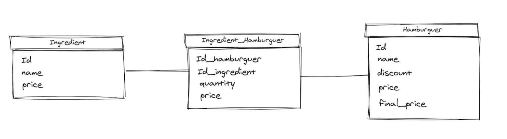
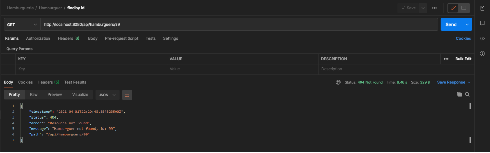
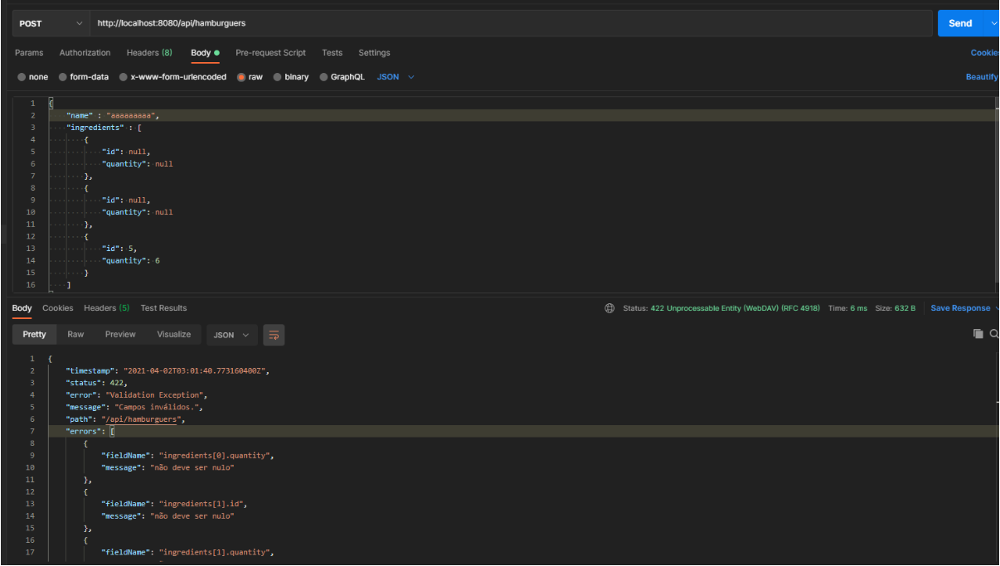
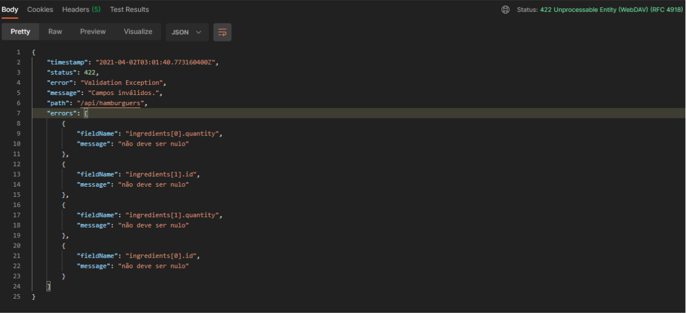

# hamburgueria

Este projeto foi feito para um desafio para a DEXTRA.

# Como rodar

[backend] - abra em alguma IDE java, baixe as dependências com maven e rode o projeto. (Java 11 necessário, por padrao roda na porta 8080)  
[frontend] - usa o comando "npm install" para baixar as dependências e em seguida ng serve para rodar a apliação Angular (por padrao roda na porta 4200).

# Realatório de decisões

A começar pelo modelo de entidades, decidi criar as classes Hamburguer e Ingredient para serem persistidas. Elas têm relação N, N e o gerenciamento será feito pela classe HamburguerIngredient que também será persistida e terá como chave primária um par de ID’s (Hambúrguer e Ingrediente) e também carregará a quantidade de determinado ingrediente no hambúrguer relacionado e o preço da unitário do ingredient.

Escolhi esta modelagem para que cada hambúrguer possa ter seus ingredientes e suas respectivas quantidades persistidos em uma tabela, isso para facilitar o cálculo do preço cheio total, descontos e preço final. A entidade hambúrguer tem price e final_price para que possamos ter dados do preço cheio (price) e do preço após desconto (final_price) que é dado quando o hambúrguer se encaixa na regra de algum desconto, quando discount é zero o final_price permanece igual ao price.

Para o cálculo do desconto eu escolhi o padrão de projeto chain of responsability. Assumi que o desconto só poderia ser aplicado a uma regra, ou seja, quando ele se encaixa em alguma regra ele não aplica outro desconto. Tomei como ordem de precedência a própria tabela disposta no desafio, primeiro Light, segundo Muita carne e terceiro Muito Queijo. Para muita carne e muito queijo eu fiz um tipo de validação apenas onde é passado o ID do ingrediente que seria aplicado a regra “Leve 3 pague 2”. Para o Light utilizei uma classe específica só para ele.

Não me preocupei em criar alguma classe para representar user ou order, pois foquei na implementação dos requisitos propostos relacionados ao cadastro de hamburguer e aplicação das regras de desconto. Também não me preocupei em fazer todas as operações de CRUD de cada entidade.

Também fiz um tratamento de exceção que trata as exceptions registradas retornando um formato de resposta padrão e um código http personalizado. Para validação com o beans validation, onde eu uso o @Valid na chamada do controller e ele já valida o DTO e retorna um corpo padrao de erro + lista de erros, cada item dessa lista carrega o nome do campo e a mensagem de erro que é relacionada a ele. Também fiz uma exceção personalizada para quando alguma entidade persistida é buscada no banco e não encontrada, assim retornando um código 404 e informações sobre o erro.

## Not Found (404)

## Validation, Unprocessable Entity (422)

